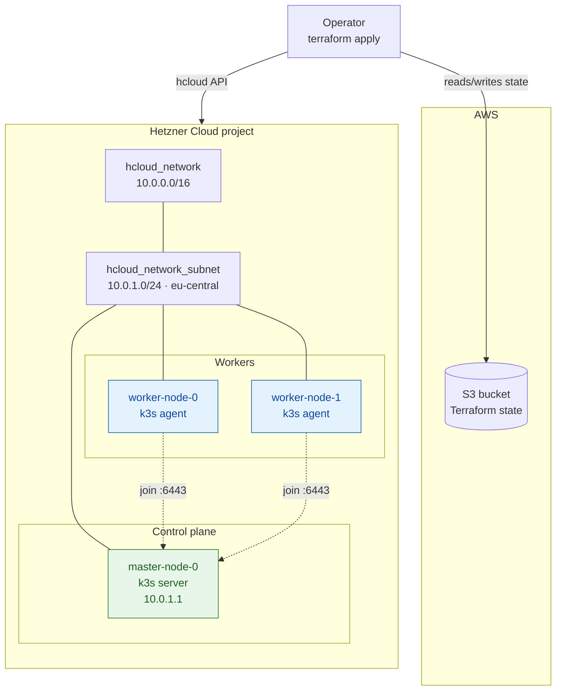
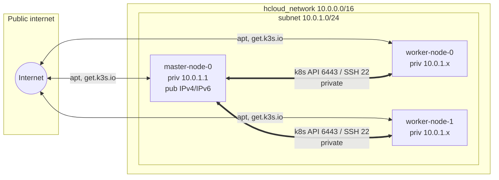
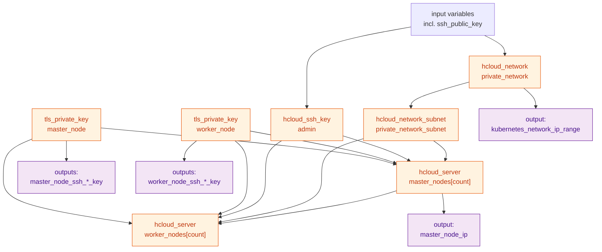
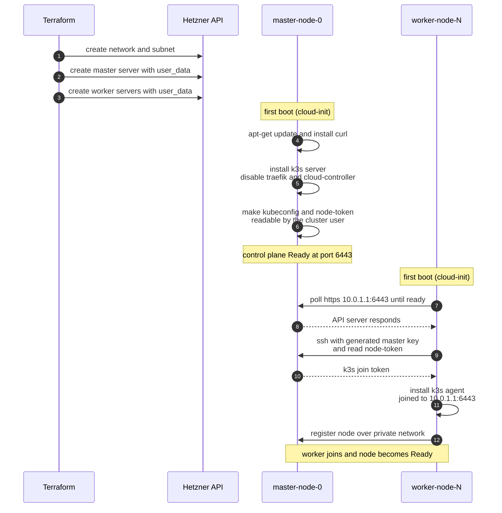
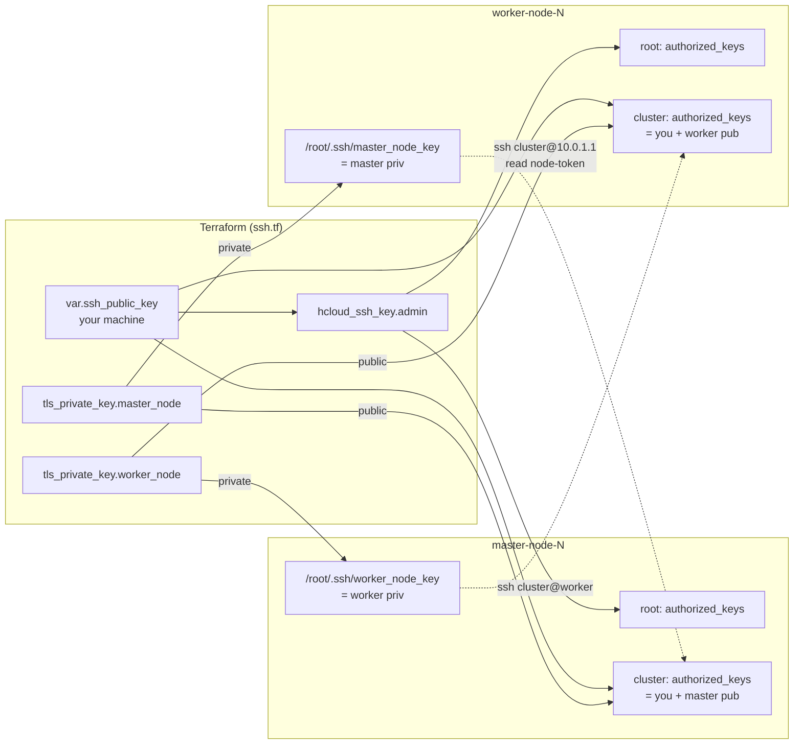

# 2. Architecture

This page describes the architecture of the cluster the module builds, using
[Mermaid](https://mermaid.js.org/) diagrams. They render natively on GitHub and
are exported as vector graphics in the PDF build.

## 2.1 Component overview

At a high level the module creates a private network, a subnet, and a set of
servers. Terraform state is kept in AWS S3 (Hetzner has no native state backend).



**Key points**

- Every node has an interface on the **private subnet** (`10.0.1.0/24`). The
  master pins itself to `10.0.1.1` (`master_node_ip`); workers get automatic
  private IPs.
- Nodes may also have **public IPv4/IPv6** (toggled by `node_enable_ipv4` /
  `node_enable_ipv6`) — used for outbound package downloads and, on the master,
  for fetching the kubeconfig.
- Workers reach the control plane at **`https://10.0.1.1:6443`** over the private
  network.

## 2.2 Network topology



| Segment | CIDR | Notes |
| --- | --- | --- |
| Network | `10.0.0.0/16` | `private_network_ip_range` |
| Subnet | `10.0.1.0/24` | `eu-central`, type `cloud` |
| Master private IP | `10.0.1.1` | `master_node_ip` (fixed) |
| Worker private IPs | `10.0.1.0/24` pool | Assigned by Hetzner |

## 2.3 Terraform resource graph

What Terraform actually manages, and the dependencies between resources:



`depends_on` wires the subnet before the servers, and the workers after the
master, so the control plane exists before any agent tries to join. The two
`tls_private_key` resources are created first — their material is rendered into
the servers' `user_data`.

## 2.4 Bootstrap sequence

The most important flow: how the cluster assembles itself from `apply` to a
Ready worker, driven entirely by cloud-init.



### What each role runs

**Master (`master-node.tf`):**

```bash
curl https://get.k3s.io | \
  INSTALL_K3S_EXEC="--disable traefik --disable-cloud-controller \
    --kubelet-arg cloud-provider=external" sh -
# then make kubeconfig + node-token readable by the "cluster" user
```

**Worker (`worker-node.tf`):**

```bash
# 1. wait for the API server
until curl -k https://10.0.1.1:6443; do sleep 5; done
# 2. pull the join token from the master over SSH, using the module-generated
#    private key that cloud-init wrote to /root/.ssh/master_node_key
REMOTE_TOKEN=$(ssh -i /root/.ssh/master_node_key -o StrictHostKeyChecking=accept-new \
  cluster@10.0.1.1 sudo cat /var/lib/rancher/k3s/server/node-token)
# 3. install and join
curl -sfL https://get.k3s.io | \
  K3S_URL=https://10.0.1.1:6443 K3S_TOKEN=$REMOTE_TOKEN \
  INSTALL_K3S_EXEC="--kubelet-arg cloud-provider=external" sh -
```

> **Trust model.** Workers authenticate to the master over SSH to read the k3s
> node-token, then use that token to join the API server. The key pair that
> makes this possible is generated by the module — see below.

## 2.5 SSH key model

The module generates **two key pairs** with the `tls` provider and distributes
them through cloud-init. Nothing but your own public key comes from a variable,
and that one is optional: skip `ssh_public_key` and pass `ssh_keys` instead to
reuse keys that already exist in your Hetzner project. Those are looked up with
the `hcloud_ssh_keys` data source so their public key material can be authorised
for the `cluster` user too — `hcloud_server.ssh_keys` alone would install them on
`root` only. When neither input is set, `hcloud_ssh_key.admin` is not created and
the `cluster` user is reachable only with the module-generated key.



| Key | Generated by | Public key lands on | Private key lands on |
| --- | --- | --- | --- |
| Admin key | you (`ssh_public_key`, optional) | `root` + `cluster` on every node | your machine only |
| Master key | `tls_private_key.master_node` | `cluster` on the master | every worker, `/root/.ssh/master_node_key` |
| Worker key | `tls_private_key.worker_node` | `cluster` on the workers | the master, `/root/.ssh/worker_node_key` |

The master key pair is what closes the bootstrap loop: a worker uses it to SSH
into the master and read `/var/lib/rancher/k3s/server/node-token`. The worker
key pair is the reverse direction, so the master (and you, via the
`worker_node_ssh_private_key` output) can reach the workers.

> **Both private keys are stored in Terraform state.** Treat the state as a
> secret: keep it in an encrypted remote backend and restrict access. Rotating
> is a matter of tainting the key resource and re-applying, which replaces the
> servers.

Continue to [Getting started »](03-getting-started.md)
