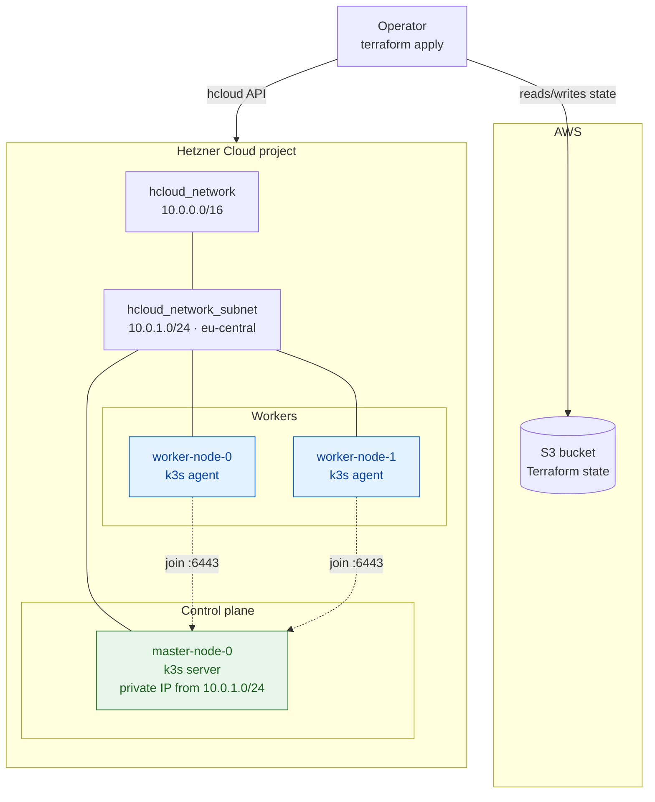
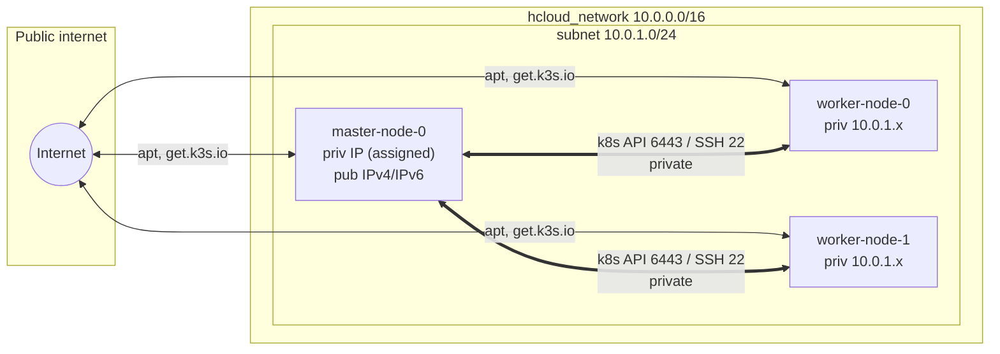
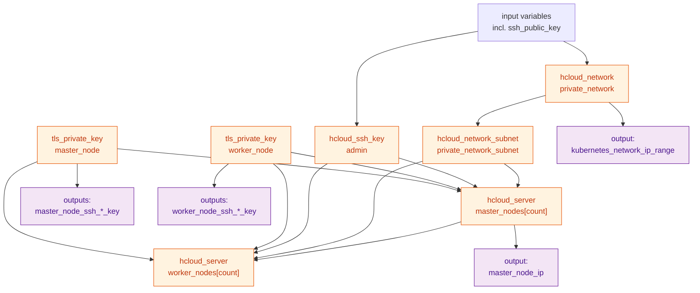
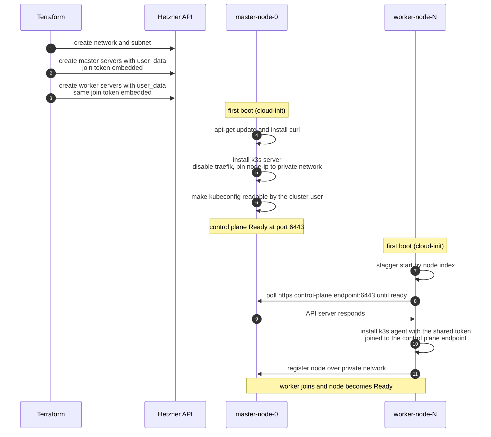
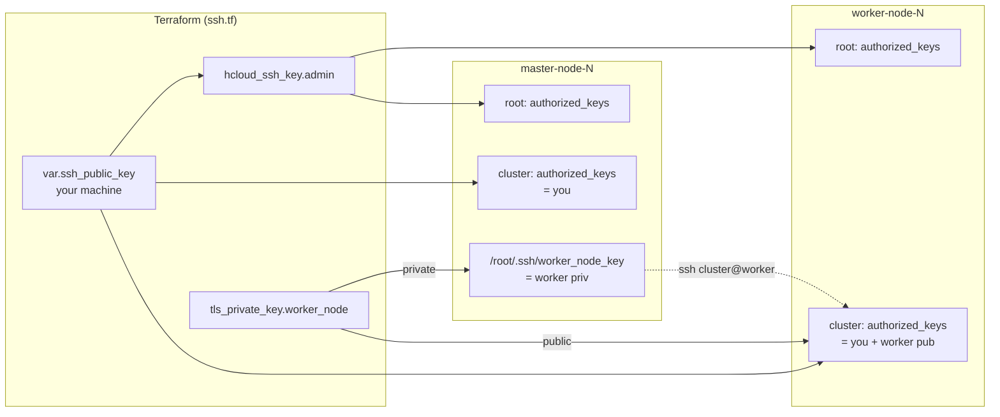
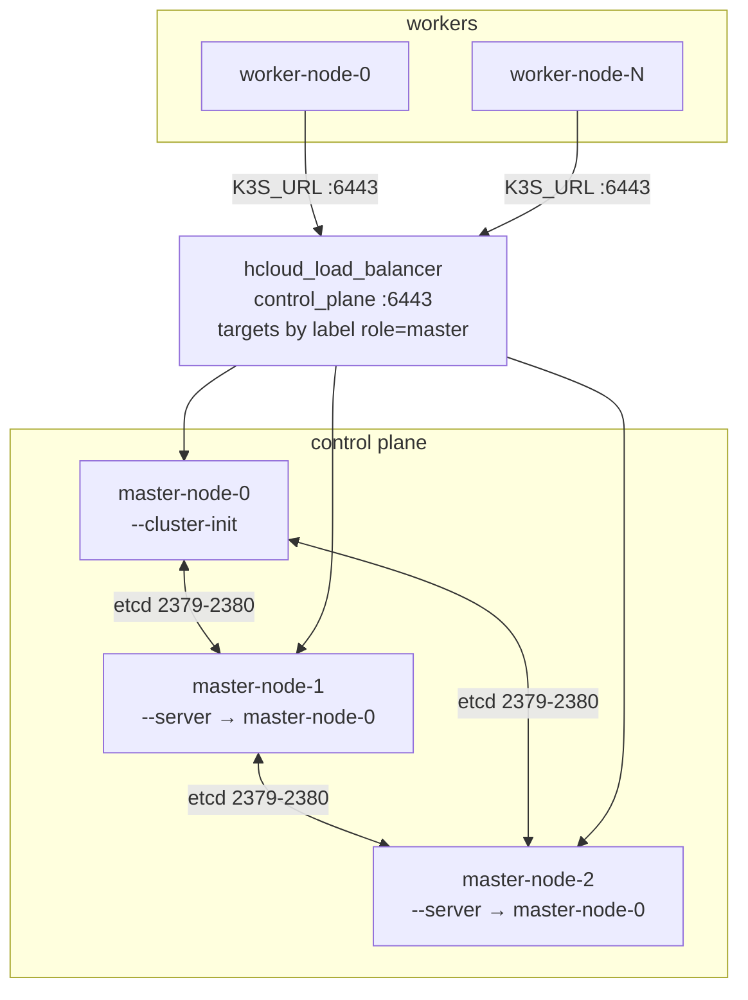

# 2. Architecture

This page describes the architecture of the cluster the module builds, using
[Mermaid](https://mermaid.js.org/) diagrams. They render natively on GitHub and
are exported as vector graphics in the PDF build.

## 2.1 Component overview

At a high level the module creates a private network, a subnet, and a set of
servers. Terraform state is kept in AWS S3 (Hetzner has no native state backend).



**Key points**

- Every node has an interface on the **private subnet** (`10.0.1.0/24`).
  Hetzner assigns every private IP; the module reads the master's back off
  `hcloud_server.master_nodes[0]` rather than pinning it.
- Nodes may also have **public IPv4/IPv6** (toggled by `node_enable_ipv4` /
  `node_enable_ipv6`) — used for outbound package downloads and, on the master,
  for fetching the kubeconfig.
- Workers reach the control plane at **`https://<master private IP>:6443`** over
  the private network.

## 2.2 Network topology



| Segment | CIDR | Notes |
| --- | --- | --- |
| Network | `10.0.0.0/16` | `private_network_ip_range` |
| Subnet | `10.0.1.0/24` | `eu-central`, type `cloud` |
| Master private IP | `10.0.1.0/24` pool | Assigned by Hetzner, read from the server |
| Worker private IPs | `10.0.1.0/24` pool | Assigned by Hetzner |

## 2.3 Terraform resource graph

What Terraform actually manages, and the dependencies between resources:



`depends_on` wires the subnet before the servers, and the workers after the
master, so the control plane exists before any agent tries to join. The two
`tls_private_key` resources are created first — their material is rendered into
the servers' `user_data`.

## 2.4 Bootstrap sequence

The most important flow: how the cluster assembles itself from `apply` to a
Ready worker, driven entirely by cloud-init.



With more than one master the first server additionally runs `--cluster-init` to
start embedded etcd, and the others wait for it and join with `--server`. See
[2.6 HA control plane](#26-ha-control-plane).

### What each role runs

Both roles bootstrap from `runcmd` in their cloud-init document, rendered per
node by Terraform.

**Master (`master-node.tf`):**

```bash
# PRIVATE_IFACE is looked up from the address Terraform assigned; PUBLIC_IP
# comes from the Hetzner metadata service and is added as a cert SAN, as is the
# API load balancer's address when the control plane is HA.
K3S_ARGS="server --disable traefik \
  --node-ip <master priv IP> --advertise-address <master priv IP> \
  --flannel-iface $PRIVATE_IFACE \
  --tls-san <master priv IP> --tls-san $PUBLIC_IP"
# with several masters, exactly one server initialises embedded etcd and the
# rest wait for it and join (see 2.6):
#   master-node-0  -> K3S_ARGS="$K3S_ARGS --cluster-init"
#   master-node-N  -> sleep N*20; poll master-0:6443; then --server https://...
for i in $(seq 1 10); do
  curl -sfL https://get.k3s.io -o /tmp/k3s-install.sh && \
    INSTALL_K3S_EXEC="$K3S_ARGS" K3S_TOKEN=<random_password.k3s_token> \
    sh /tmp/k3s-install.sh && break
  sleep 15
done
# then make the kubeconfig readable by the "cluster" user
```

**Worker (`worker-node.tf`):**

```bash
# 1. spread the joins of a large pool instead of arriving all in one second
sleep $(( (index % 20) * 3 ))
# 2. wait for the control plane: the API load balancer when the control plane
#    is HA, otherwise the first master
for i in $(seq 1 240); do curl -skf --max-time 5 https://<endpoint>:6443/ping && break; sleep 5; done
# 3. install and join with the token Terraform generated. No SSH hop: the agent
#    is handed the same token the servers were given.
for i in $(seq 1 10); do
  curl -sfL https://get.k3s.io -o /tmp/k3s-install.sh && \
    K3S_URL=https://<endpoint>:6443 K3S_TOKEN=<random_password.k3s_token> \
    INSTALL_K3S_EXEC="--node-ip <worker priv IP> --flannel-iface $PRIVATE_IFACE" \
    sh /tmp/k3s-install.sh && break
  sleep 15
done
```

> **Why the installer is downloaded before it runs.** `curl ... | sh` reports
> the exit status of `sh`, which succeeds on empty input, so a failed download
> looks like a successful install. Downloading to a file first makes the retry
> loop above able to tell the two apart.

> **Why `--node-ip` / `--flannel-iface`.** Left to itself k3s picks the address
> of the default route, which on Hetzner is the *public* interface. The firewall
> scopes the kubelet port (10250) and the Flannel VXLAN port (8472/UDP) to the
> private range, so the overlay and `kubectl logs`/`exec` would be dropped.

> **Trust model.** Every node is handed the same k3s join token, generated by
> Terraform as `random_password.k3s_token` and embedded in `user_data`. Anyone
> who can read a node's `user_data` through the Hetzner API, or the Terraform
> state, can join a node to the cluster — restrict both.

## 2.5 SSH key model

The module generates **two key pairs** with the `tls` provider and distributes
them through cloud-init. Nothing but your own public key comes from a variable,
and that one is optional: skip `ssh_public_key` and pass `ssh_keys` instead to
reuse keys that already exist in your Hetzner project. Those are looked up with
the `hcloud_ssh_keys` data source so their public key material can be authorised
for the `cluster` user too — `hcloud_server.ssh_keys` alone would install them on
`root` only. When neither input is set, `hcloud_ssh_key.admin` is not created,
and the `cluster` user on a master has no authorised key at all — reach the node
as `root` with a key from your Hetzner project instead.



| Key | Generated by | Public key lands on | Private key lands on |
| --- | --- | --- | --- |
| Admin key | you (`ssh_public_key`, optional) | `root` + `cluster` on every node | your machine only |
| Worker key | `tls_private_key.worker_node` | `cluster` on the workers | the masters, `/root/.ssh/worker_node_key` |

There is deliberately only one generated pair, and it runs master → worker. An
earlier version of the module also generated a master pair and put its private
half on every worker, because a worker bootstrapped by SSHing into the master to
read `/var/lib/rancher/k3s/server/node-token`. Nodes now join with a token
Terraform generates (`random_password.k3s_token`), so that pair had no remaining
use and its removal takes the control plane's credentials off every worker.

You reach both roles with your own key — `ssh_public_key` and `ssh_keys` are
authorised for `cluster` on masters and workers alike.

> **The generated private key and the cluster join token are both stored in
> Terraform state.** Treat the state as a secret: keep it in an encrypted remote
> backend and restrict access. Rotating is a matter of replacing the key
> resource and re-applying, which replaces the servers.

## 2.6 HA control plane

`master_nodes_number` above 1 builds a single cluster whose state lives in
embedded etcd, rather than one standalone cluster per master. Two things make
that work, and both are easy to miss:

- **One shared join token.** Left alone, each `k3s server` generates its own
  random token, and servers with different tokens cannot join each other. The
  module generates `random_password.k3s_token` and hands the same value to every
  node.
- **`--cluster-init` on exactly one server.** The first master initialises the
  etcd cluster; the others join it with `--server`. Without this flag a server
  comes up standalone on its own SQLite database — quietly, and looking healthy.

etcd forms a quorum, so `master_nodes_number` is validated to be 1, 3, 5 or 7.
An even number lowers availability rather than raising it, and past seven the
write latency of the raft log outweighs the redundancy.



**Why the load balancer.** Agents take a fixed `K3S_URL`. Pointing them at one
master makes that master a single point of failure however many servers the
control plane has, so with HA the workers join through
`hcloud_load_balancer.control_plane` instead and its address is added to the API
server's `--tls-san`. It serves the private network only by default: Hetzner
firewalls do not apply to load balancers, so a public listener would bypass
`kube_api_source_ips`.

Its targets are selected by the label `role=master` rather than by server ID, on
purpose. The masters read the load balancer's addresses for their TLS SANs, so a
target referring to `hcloud_server.master_nodes` would close a dependency cycle.
A label selector is resolved by the Hetzner API instead, and picks up masters
added later.

**Ordering.** The servers are one `count` resource, so Terraform creates them in
parallel and cannot sequence the etcd join for us. The bootstrap script does it
instead: master 0 initialises, and each other master sleeps `index × 20s`, waits
for master 0 to answer on `:6443`, and only then joins. etcd admits members one
at a time, so arriving together is what to avoid.

**Two known limitations.**

- New masters always join through master 0. If master 0 is permanently gone,
  adding a master needs the join target changed by hand.
- Going from one master to several changes master 0's `user_data`, which
  replaces the server and so rebuilds the cluster. Pick the control plane size
  before the first apply where you can.

Continue to [Getting started »](03-getting-started.md)
