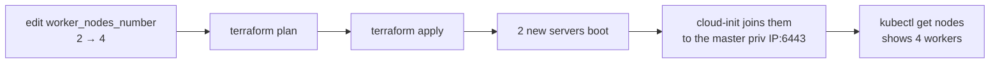

# 6. Operations

Day-2 tasks for a running cluster.

## 6.1 Accessing the cluster

First materialise the generated key for the `cluster` user:

```bash
terraform output -raw master_node_ssh_private_key > ./master_key
chmod 600 ./master_key
```

Then copy the kubeconfig off the master and repoint it at the master's reachable
IP:

```bash
scp -i ./master_key cluster@<master_public_ip>:/etc/rancher/k3s/k3s.yaml ~/.kube/config
sed -i '' "s/127.0.0.1/<master_public_ip>/" ~/.kube/config   # macOS sed
kubectl get nodes -o wide
```

For a private-only setup, tunnel to the API server instead of exposing it:

```bash
ssh -i ./master_key -L 6443:<master_private_ip>:6443 cluster@<master_public_ip>
# then use a kubeconfig pointing at https://127.0.0.1:6443
```

Workers are reachable the same way, with the worker key pair:

```bash
terraform output -raw worker_node_ssh_private_key > ./worker_key
chmod 600 ./worker_key
ssh -i ./worker_key cluster@<worker_public_ip>
```

## 6.2 Verifying bootstrap

```bash
# on the master
sudo systemctl status k3s
sudo journalctl -u k3s -f

# on a worker
sudo systemctl status k3s-agent
sudo journalctl -u k3s-agent -f
```

Expected end state: `kubectl get nodes` shows the master plus
`worker_nodes_number` agents in `Ready`.

## 6.3 Scaling

The cluster size is parameterised — change the count and re-apply.



```bash
# scale workers up (or down)
terraform apply -var 'worker_nodes_number=4'
```

Scaling **down** removes the highest-indexed servers. Drain them first so
workloads reschedule cleanly:

```bash
kubectl drain worker-node-3 --ignore-daemonsets --delete-emptydir-data
terraform apply -var 'worker_nodes_number=3'
kubectl delete node worker-node-3     # remove the stale Node object
```

### Applying a large cluster

Past roughly 30 nodes, cap Terraform's concurrency:

```bash
terraform apply -parallelism=5 -var 'worker_nodes_number=100'
```

Terraform defaults to ten concurrent resource operations, and each server it
creates is not one API call but several — create, then poll the action until the
server is running, then attach the network, then poll again. A hundred servers
at the default concurrency will spend most of an apply polling, and a Hetzner
project is limited to **3600 API requests per hour**. Hit that ceiling and the
provider starts receiving `rate_limit_exceeded` partway through, which leaves
servers half-created and the state file disagreeing with reality — a far more
tedious problem than a slow apply.

`-parallelism=5` keeps the request rate inside the budget. The apply takes
longer in wall-clock terms, but it is the difference between a slow apply and a
failed one. It is a CLI flag rather than a setting the module can carry, so it
has to be passed on every apply (and `destroy`) of a large cluster.

Two things to expect regardless of concurrency:

- Nodes join over several minutes, not seconds. Workers deliberately stagger
  their joins, and an HA control plane admits etcd members one at a time.
  `terraform apply` returning is not the same as `kubectl get nodes` being
  complete; watch the latter.
- A hundred servers of one type in one location can exhaust that location's
  capacity. `resource_unavailable` from the API means Hetzner has no room for
  that server type there, not that anything is misconfigured.

## 6.4 Rotating the node SSH keys

The module generates one key pair, `tls_private_key.worker_node`: the workers
trust its public half and the masters hold its private half, which is how a
master reaches a worker. It is a Terraform resource, so rotation is a replace +
apply. Because the key is baked into `user_data`, **replacing it replaces the
servers** — treat it as a cluster rebuild, not an in-place change.

```bash
terraform plan -replace='tls_private_key.worker_node'
terraform apply -replace='tls_private_key.worker_node'
```

Rotating your own key is cheap by comparison: change `ssh_public_key` and
re-apply. That also recreates the nodes (cloud-init `user_data` changes), so for
day-to-day access prefer adding keys to `~cluster/.ssh/authorized_keys` on the
running nodes.

## 6.5 What to deploy next

The module deliberately ships a bare cluster (Traefik is disabled). Typical next
steps, ideally via GitOps:

| Concern | Options |
| --- | --- |
| Cloud controller | [hcloud-cloud-controller-manager](https://github.com/hetznercloud/hcloud-cloud-controller-manager), for Hetzner load balancers and provider IDs. Deploy it **first**, then add `--kubelet-arg cloud-provider=external` and `--disable-cloud-controller` to the k3s args — adding those flags without a working CCM leaves nodes with no `InternalIP` and crash-loops the k3s server |
| CNI / networking | k3s ships Flannel by default; swap for Cilium/Calico if needed |
| Ingress | ingress-nginx, Traefik (re-enabled), or Gateway API |
| Storage | [hcloud-csi-driver](https://github.com/hetznercloud/csi-driver) for Hetzner Volumes |
| GitOps | Argo CD or Flux |
| Monitoring | kube-prometheus-stack (Prometheus + Grafana + Alertmanager) |

## 6.6 Teardown

```bash
terraform destroy
```

A large cluster needs the same concurrency cap as its apply, for the same
API-rate-limit reason:

```bash
terraform destroy -parallelism=5
```

This removes the servers, subnet, and network. **State lives in S3** and is
unaffected — delete the state object separately if you're retiring the workspace.

> **Before destroying:** back up anything you need (PersistentVolumes, etc.).
> Hetzner Volumes and Load Balancers created *inside* the cluster by controllers
> are **not** managed by this module and may need separate cleanup.

Back to the [documentation index](README.md).
