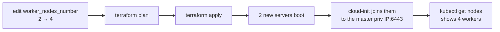

# 6. Operations

Day-2 tasks for a running cluster.

## 6.1 Accessing the cluster

You log in as the **`cluster`** user with the key you gave the module
(`ssh_public_key` / `ssh_keys`). `root` logins are refused, as are password
logins — see [Architecture §2.7](02-architecture.md#27-node-ssh-hardening).

```bash
terraform output master_nodes_ips
ssh cluster@<master_public_ip>            # sudo is passwordless
```

With `use_tailscale = true`, the same node answers on its tailnet name and
Tailscale SSH authorises you from the tailnet ACLs instead of `authorized_keys`:

```bash
ssh cluster@master-node-0
```

Copy the kubeconfig off the master and repoint it at the master's reachable IP:

```bash
scp cluster@<master_public_ip>:/etc/rancher/k3s/k3s.yaml ~/.kube/config
sed -i '' "s/127.0.0.1/<master_public_ip>/" ~/.kube/config   # macOS sed
kubectl get nodes -o wide
```

Whatever address you substitute must be covered by the API server certificate.
The masters' private and public IPs and the API load balancer are covered
automatically; anything else — a DNS name, a Tailscale address — has to be
listed in `extra_tls_sans` **before** the apply, because the certificate is
generated at install time.

> **`ssh -L` no longer works.** The hardening drop-in sets
> `AllowTcpForwarding no`, so tunnelling to the API server over SSH is refused
> by the server. For a private-only control plane use one of these instead:
>
> - Tailscale (`use_tailscale = true`) and a kubeconfig pointing at the node's
>   tailnet address, with that address in `extra_tls_sans`;
> - `kube_api_source_ips` narrowed to your own address, with `kubectl` going
>   straight to a master's public IP;
> - `kubectl --server` through a bastion inside the private network.
>
> If you would rather keep the tunnel, drop `AllowTcpForwarding no` from the
> `write_files` block in `master-node.tf` and `worker-node.tf` — note that
> changing `user_data` replaces the servers.

Workers are reached the same way:

```bash
terraform output worker_nodes_ips
ssh cluster@<worker_public_ip>
```

From a master you can also reach a worker with the key the module generated and
placed there:

```bash
sudo ssh -i /root/.ssh/worker_node_key cluster@<worker_private_ip>
```

> **Too many keys in your agent.** `MaxAuthTries 3` means sshd closes the
> connection after three failed offers, and your agent offers its keys before
> the one you pass with `-i`. Add `-o IdentitiesOnly=yes` if you are refused
> with a key you know is authorised.

## 6.2 Verifying bootstrap

```bash
# on the master
sudo systemctl status k3s
sudo journalctl -u k3s -f

# on a worker
sudo systemctl status k3s-agent
sudo journalctl -u k3s-agent -f
```

Expected end state: `kubectl get nodes` shows the master plus
`worker_nodes_number` agents in `Ready`.

## 6.3 Scaling

The cluster size is parameterised — change the count and re-apply.


```mermaid
flowchart LR
  A["edit worker_nodes_number<br/>2 → 4"] --> B["terraform plan"]
  B --> C["terraform apply"]
  C --> D["2 new servers boot"]
  D --> E["cloud-init joins them<br/>to the master priv IP:6443"]
  E --> F["kubectl get nodes<br/>shows 4 workers"]
```

```bash
# scale workers up (or down)
terraform apply -var 'worker_nodes_number=4'
```

Scaling **down** removes the highest-indexed servers. Drain them first so
workloads reschedule cleanly:

```bash
kubectl drain worker-node-3 --ignore-daemonsets --delete-emptydir-data
terraform apply -var 'worker_nodes_number=3'
kubectl delete node worker-node-3     # remove the stale Node object
```

### Applying a large cluster

Past roughly 30 nodes, cap Terraform's concurrency:

```bash
terraform apply -parallelism=5 -var 'worker_nodes_number=100'
```

Terraform defaults to ten concurrent resource operations, and each server it
creates is not one API call but several — create, then poll the action until the
server is running, then attach the network, then poll again. A hundred servers
at the default concurrency will spend most of an apply polling, and a Hetzner
project is limited to **3600 API requests per hour**. Hit that ceiling and the
provider starts receiving `rate_limit_exceeded` partway through, which leaves
servers half-created and the state file disagreeing with reality — a far more
tedious problem than a slow apply.

`-parallelism=5` keeps the request rate inside the budget. The apply takes
longer in wall-clock terms, but it is the difference between a slow apply and a
failed one. It is a CLI flag rather than a setting the module can carry, so it
has to be passed on every apply (and `destroy`) of a large cluster.

Two things to expect regardless of concurrency:

- Nodes join over several minutes, not seconds. Workers deliberately stagger
  their joins, and an HA control plane admits etcd members one at a time.
  `terraform apply` returning is not the same as `kubectl get nodes` being
  complete; watch the latter.
- A hundred servers of one type in one location can exhaust that location's
  capacity. `resource_unavailable` from the API means Hetzner has no room for
  that server type there, not that anything is misconfigured.

## 6.4 Rotating the node SSH keys

The module generates one key pair, `tls_private_key.worker_node`: the workers
trust its public half and the masters hold its private half, which is how a
master reaches a worker. It is a Terraform resource, so rotation is a replace +
apply. Because the key is baked into `user_data`, **replacing it replaces the
servers** — treat it as a cluster rebuild, not an in-place change.

```bash
terraform plan -replace='tls_private_key.worker_node'
terraform apply -replace='tls_private_key.worker_node'
```

Rotating your own key is cheap by comparison: change `ssh_public_key` and
re-apply. That also recreates the nodes (cloud-init `user_data` changes), so for
day-to-day access prefer adding keys to `~cluster/.ssh/authorized_keys` on the
running nodes.

### Rotating the Tailscale auth key

`tailscale_auth_key` is only read once, when a node first joins the tailnet, and
a node that is already up stays authenticated on its own node key. Changing the
variable therefore has no effect on running nodes — but it does change
`user_data`, so Terraform will want to replace every server. Revoke the key in
the Tailscale admin console after the apply instead, and use an ephemeral key so
the credential in state expires on its own.

To take a node off the tailnet without rebuilding it, delete it in the Tailscale
admin console (or run `sudo tailscale logout` on the node). Make sure you still
have SSH access by another route first — with no `ssh_public_key` and no
`ssh_keys`, Tailscale SSH is the only way in.

## 6.5 What to deploy next

The module deliberately ships a bare cluster (Traefik is disabled). Typical next
steps, ideally via GitOps:

| Concern | Options |
| --- | --- |
| Cloud controller | [hcloud-cloud-controller-manager](https://github.com/hetznercloud/hcloud-cloud-controller-manager), for Hetzner load balancers and provider IDs. Deploy it **first**, then add `--kubelet-arg cloud-provider=external` and `--disable-cloud-controller` to the k3s args — adding those flags without a working CCM leaves nodes with no `InternalIP` and crash-loops the k3s server |
| CNI / networking | k3s ships Flannel by default; swap for Cilium/Calico if needed |
| Ingress | ingress-nginx, Traefik (re-enabled), or Gateway API |
| Storage | [hcloud-csi-driver](https://github.com/hetznercloud/csi-driver) for Hetzner Volumes |
| GitOps | Argo CD or Flux |
| Monitoring | kube-prometheus-stack (Prometheus + Grafana + Alertmanager) |
| Remote access | Tailscale is installed by the module when `use_tailscale` is set; a [Tailscale Kubernetes operator](https://tailscale.com/kb/1236/kubernetes-operator) on top exposes Services on the tailnet |

### Patching

`package_update` and `package_upgrade` in cloud-init only cover the **first
boot** — they are not a patching policy. A long-lived node still needs
`unattended-upgrades` or a rebuild cadence of your own. Rebuilding is the
cleaner option here: a node is disposable, and replacing it re-runs cloud-init
against a fresh image.

```bash
kubectl drain worker-node-1 --ignore-daemonsets --delete-emptydir-data
terraform apply -replace='hcloud_server.worker_nodes[1]'
```

## 6.6 Teardown

```bash
terraform destroy
```

A large cluster needs the same concurrency cap as its apply, for the same
API-rate-limit reason:

```bash
terraform destroy -parallelism=5
```

This removes the servers, subnet, and network. **State lives in S3** and is
unaffected — delete the state object separately if you're retiring the workspace.

> **Before destroying:** back up anything you need (PersistentVolumes, etc.).
> Hetzner Volumes and Load Balancers created *inside* the cluster by controllers
> are **not** managed by this module and may need separate cleanup.

Back to the [documentation index](index.md).
